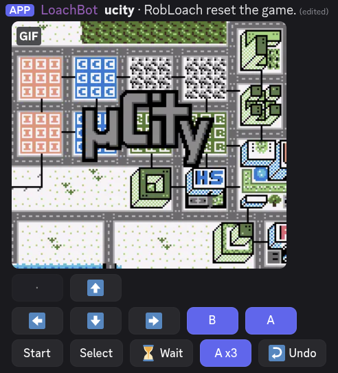

# Retro

Play retro console games together in Discord. Attach a ROM and control the game
with a controller built out of Discord buttons. Every press posts a short
animated clip of the next second of play, so you see the game react instead of
a still frame. Anyone in the channel can play.

Nine consoles, from the Nintendo Entertainment System to the Game Boy Advance.
Emulation is [libretro.py](https://github.com/JesseTG/libretro.py) running
cores from the [libretro buildbot](https://buildbot.libretro.com).

Games remember where they were. A channel's game keeps playing across days, cog
reloads and bot restarts — nothing is ever "timed out and lost".

> Only use ROMs you have the rights to. There are hundreds of free, legal
> homebrew games for these consoles at <https://retrobrews.github.io/>.



**Looking for why it works the way it does?** That is
[docs/DESIGN.md](../docs/DESIGN.md) — the decisions, the measurements behind
them, and the things that were tried and reversed. This file is how to use it.

## Contents

- [Getting started](#getting-started)
- [Starting a game](#starting-a-game)
- [The controller](#the-controller)
- [Saving and sleeping](#saving-and-sleeping)
- [Managing saves](#managing-saves)
- [Settings](#settings)
- [Core options](#core-options)
- [BIOS files](#bios-files)
- [Command reference](#command-reference)
- [Troubleshooting](#troubleshooting)
- [Permissions](#permissions)
- [ROM URLs](#rom-urls)
- [Upgrading](#upgrading)

## Getting started

Install and load the cog:

```
[p]repo add robloach-cogs https://github.com/RobLoach/robloach-cogs
[p]cog install robloach-cogs retro
[p]load retro
```

**There is nothing to configure.** The seven emulator cores that cover all nine
consoles — about 4.5 MiB to download, 31 MiB unpacked, none needing a BIOS —
start downloading in the background as soon as the cog loads. To do it now, or
to check on it:

```
[p]retroset download
[p]retroset settings
```

Cores are *detected*, not registered: the cog scans its own `cores` folder
every time it needs one, so a core that is simply there is playable
immediately, as long as it keeps its buildbot filename
(`snes9x_libretro.so`, `gambatte_libretro.dll`).

Then play. [µCity](https://github.com/AntonioND/ucity) is a complete open
source city builder for the Game Boy Color, and makes a good first game:

```
[p]retro https://github.com/AntonioND/ucity/releases/download/v1.3/ucity.gbc
```

Save it so anyone can start it by name:

```
[p]retroset game add ucity https://github.com/AntonioND/ucity/releases/download/v1.3/ucity.gbc
[p]retro ucity
```

## Starting a game

Four ways, all `[p]retro`:

```
[p]retro ucity            a game saved by name
[p]retro <url>            a direct link to a ROM
[p]retro                  with a ROM or .zip attached to the message
[p]retro                  with nothing running: lists what you can start
```

`/retro play game:` is the same thing as a slash command, and **autocompletes
over the saved games** — which is how you find out what a bot has without
running a second command first. `[p]retro list` shows the same list as text,
and both offer a **dropdown to pick from**.

With a game already running in the channel, a bare `[p]retro` brings it back
instead.

### Attaching a ROM

Attach the file to the message you run `[p]retro` with. A raw ROM and a `.zip`
both work, up to 32 MiB.

**You can type a name as well.** `[p]retro Super Mario` with the ROM attached
starts the ROM. A saved name or a URL wins if the text is one, because either
of those names a ROM outright.

For a `.zip`, the cog looks inside and takes the first file whose extension is
one of the consoles below, alphabetically, and says which it picked if there
was a choice. **If you typed a name, it takes that one instead**: `[p]retro
sonic` with a compilation attached starts `Sonic.md`. The name is matched on
the filename inside the zip, with or without the extension.

Folders inside the archive are fine. Nothing is unpacked using the paths in the
archive, the uncompressed size is checked before anything is read, and a
corrupt or password-protected archive gets a plain explanation.

### Consoles

The console is chosen from the ROM's file extension. Every core here is
BIOS-free — nothing but the ROM is needed.

| Console | Core | File extensions |
| --- | --- | --- |
| Game Boy / Color | `gambatte` | `.gb` `.gbc` `.dmg` |
| Game Boy Advance | `mgba` | `.gba` |
| Nintendo Entertainment System | `fceumm` | `.nes` `.unf` `.unif` |
| Super Nintendo | `snes9x` | `.smc` `.sfc` `.swc` `.fig` |
| Sega Genesis / Mega Drive | `genesis_plus_gx` | `.md` `.mdx` `.smd` `.gen` `.68k` `.sgd` |
| Sega Master System | `genesis_plus_gx` | `.sms` `.sg` |
| Sega Game Gear | `genesis_plus_gx` | `.gg` |
| PC Engine / TurboGrafx-16 | `mednafen_pce_fast` | `.pce` |
| Neo Geo Pocket | `mednafen_ngp` | `.ngp` `.ngc` `.ngpc` `.npc` |

**`.bin` is refused on purpose.** It is the commonest ROM extension in the wild
and carries no console information at all — an Atari cartridge, a Mega Drive
ROM, a raw CD track and a BIOS dump are all `.bin` — so accepting it would mean
guessing, and guessing wrong loads somebody's disc track as a Mega Drive game.
**Rename a Genesis ROM to `.md` and it starts.**

`.cue`, `.iso` and `.chd` are CD images and these are all cartridge machines.
`.fds`, `.bs` and `.st` need a BIOS or a base cartridge. Each of those says so
when you try it; an extension that is merely unknown gets the plain "not a
console this bot knows".

Each console shows its own controls, with the names printed on its own
controller: the Genesis gets **A B C** (and **X Y Z** and **Mode**), the Master
System **1**, **2** and **Pause**, the PC Engine **I** through **VI** and
**Run**. The Game Gear shares the Master System's core but is its own console
here — a `.gg` game says *Game Gear*, and its third button is **Start**,
because **Pause** is on the Master System's console deck and a handheld has no
such thing.

## The controller

The buttons are laid out like the console's own pad: the d-pad is a cross on
the left, the face buttons sit to its right, and the three controls —
**Wait**, **×3** and **Undo** — sit on the end of the bottom row. A Game Boy,
where `·` is a greyed-out spacer holding the column open:

```
·  ⬆️
⬅️  ⬇️  ➡️   B  A
Start  Select  ⏳ Wait   A ×3   ↩️ Undo
```

Consoles with more buttons grow into the same shape — the Game Boy Advance puts
**L** and **R** on the top row, the Super Nintendo adds a **Y X / B A** block,
and the six-button Genesis and PC Engine keep their two-by-three face cluster:

```
·  ⬆️   X  Y  Z
⬅️  ⬇️  ➡️
·  ·   A  B  C
Mode  Start  ⏳ Wait   B ×3   ↩️ Undo
```

**⏳ Wait** lets one clip's worth of time pass with no input, for a game that is
doing something on its own.

**↩️ Undo** steps the game back one press, up to **eight presses** deep. Wait
and ×3 count as presses. There is no redo. Every press takes a save state
before it changes anything, so a misclick costs nothing — and the history is
kept on disk, so it survives a bot restart. Undo reaches back across a sleep
too. Updating a core empties it, because a save state only loads on the build
that wrote it.

**A ×3** taps the console's confirm button several times in one clip, so a text
box or a menu takes one round trip instead of three. It is labelled with that
console's own button name and the number of taps it will really do.

**It is hidden, not greyed out, when only one tap fits** — one tap is exactly
what the confirm button one row over already does. It comes back on the next
press as soon as clips are long enough:

| Clip length | Taps | The button |
| --- | --- | --- |
| 0.2s (the floor) | 1 | not shown |
| 0.45s | 1 | not shown |
| 0.46s | 2 | `A ×2` |
| 0.72s | 2 | `A ×2` |
| 0.73s | 3 | `A ×3` |
| 1s (the default) | 3 | `A ×3` |
| 5s (the ceiling) | 3 | `A ×3` |

**Wait and Undo never move**, whether or not ×3 is drawn.

There is no **Stop** and no **Reset** button. Sleeping a game
(`[p]retrosleep`), rebooting it (`[p]retroreboot`) and finishing with it
(`[p]retroend`) are all commands, because each is destructive to a game
everybody in the channel is playing and none should be one mis-tap away.

### What a press does

Each press records the next **second** of play (`[p]retroset cliplength`,
0.2–5s and fractional) and posts it as an animated WebP that plays through
once and stops. A button is held for 160ms (`[p]retroset hold`) — long enough
that no game misses it, short enough that one press is one action.

**The game only runs while a clip is being recorded.** Between presses the
console is frozen mid-frame, so nothing can happen to you while nobody is
looking and a game left overnight is exactly where you left it.

The message carries the clip and **one line** of text:

> **µCity** · Rob pressed A. *Queued: ⬅️*

The game's name, what just happened, and what is queued behind it. Names are
posted as plain text and **can never notify anybody**.

**A press that lands while somebody else's is being emulated is queued, not
dropped**, up to five deep, first come first served — one person may hold every
slot, because tapping a direction several times in a row is how people
actually play. Every waiting press is listed on the message. The queue is
thrown away whenever the game stops being the thing those presses were aimed
at: sleep, reboot, undo, an idle timeout, or another channel taking the
emulator, and the message says how many went.

**A clip is not replaced until it has had its playing time on screen**, so you
always see a clip through before the next one lands. A press that arrives when
nothing is playing is still instant.

## Saving and sleeping

**The cog never throws a game away.** Progress is written automatically — every
few presses, whenever a game sleeps, when the cog is unloaded — next to a
cached copy of the ROM. Every save is written beside its target and renamed
into place, so a crash leaves the previous save rather than half of a new one.

A game **sleeps** after 10 minutes without input (`[p]retroset timeout`), on
`[p]retrosleep`, or when the bot shuts down. Sleeping frees the emulator and
keeps the controls live: the next press wakes the game exactly where it was,
even across a restart. Waking takes about 25ms.

**One game runs at a time across the whole bot.** A libretro core is a shared
library with global state, so when a second channel starts playing, the first
channel's game is saved and put to sleep, and both channels are told.

**Starting a game again always picks up its save**, whether it is still the
channel's game or was replaced five games ago.

**A replaced game keeps a Resume button.** When a channel moves on, the old
message's controls become a single **▶️ Resume**:

> Replaced by **µCity**. **Libbet** was saved — press Resume to come back to it.

It keeps working after a restart. A channel keeps one per cached game, five at
most.

### Two kinds of save

A **save state** is the exact moment a game was left at, down to the frame. It
only loads on the same build of the same emulator. An **in-game save** is what
you saved from inside the game, on its own menu — the cartridge's battery
memory, stored as a `.srm` any emulator can read.

Both are written on the same schedule, because **updating a core invalidates
every save state it wrote**. When a game wakes, the save state is preferred; if
it is missing or the core has changed, the game boots fresh with the in-game
save poured back in, and says so:

> This game's save state could not be used (most likely the emulator core was
> updated), so it started from the title screen — but your in-game save
> survived. Load it from the game's own menu to carry on.

Plenty of cartridges have no battery at all — most puzzle games, most test
ROMs. That is normal, not a failure.

### What is deleted, and what never is

| | what it is | when it goes |
| --- | --- | --- |
| **session** and **Resume** records | a pointer: *this message was playing this game* | by itself, as soon as it cannot resume anything |
| **save state** and **in-game save** | your progress, keyed by channel **and game** | only when you ask (`[p]retrosaves delete`) |

Because progress is keyed by channel and game rather than by message, dropping
a record loses the button and nothing else. The cog drops records by itself
when the cached ROM was pruned, when the channel or thread was deleted, or when
the bot left the server. **The saves are kept either way** — `[p]retro <name>`
re-downloads the ROM and picks the save straight back up.

## Managing saves

```
[p]retrosaves                          list this channel's saved games
[p]retrosaves <game>                   one game in detail
[p]retrosaves export <game>            post the in-game save as a file
[p]retrosaves export state|both <game> send the save state too
[p]retrosaves import <game>            install an attached save file
[p]retrosaves dropstate <game>         delete the save state only
[p]retrosaves rollback <game>          go back one save-state generation
[p]retrosaves delete <game>            wipe both halves, after asking
```

A listing:

```
**3 game(s)** in this channel, 2 with saved progress, 434.6 KiB in total.

**µCity** — `ucity` • Game Boy • **playing now**
  save state 178.3 KiB, 2 minutes ago • in-game save 128.0 KiB, 2 minutes ago
**Tobu Tobu Girl** — `tobu` • Game Boy • resumable
  save state 178.3 KiB, 3 days ago
```

`info` adds the console and core, whether the cached ROM is still there, and
what starting the game right now would actually do.

**`dropstate` and `delete` are different things.** `dropstate` deletes the save
state and keeps the in-game save — "restart from my last in-game save".
`delete` wipes both — "start this game completely fresh" — and asks first.
Neither touches the cached ROM.

**`rollback`** goes back to the previous save-state generation: the durable,
on-disk version of the **Undo** button, for when the in-memory history is gone.

**Exporting** posts the `.srm` as a plain attachment. The save state is only
sent when asked for, because it is larger and only loads on the same core
build.

**Importing** is checked before anything is written: the file has to be named
like a save, be inside the size ceilings (1 MiB for an in-game save, 16 MiB for
a state), and then actually fit — the game is booted on the real core and the
files offered to it, so a save for the wrong cartridge comes back as

> That in-game save is 8.0 KiB (8,192 bytes) but **µCity** has 128.0 KiB
> (131,072 bytes) of save memory.

**A game being played right now is saved and put to sleep first**, and its Undo
history is dropped. A running emulator holds the authoritative copy and would
write it straight back over the change on the next press.

**Who may do what.** Listing, `info` and `export` are open to the channel, like
playing. `dropstate`, `delete` and `import` want the person who started the
game, **Manage Messages**, or the bot owner.

## Settings

All owner-only, all bot-wide.

| Setting | Default | What it does |
| --- | --- | --- |
| `[p]retroset cliplength <seconds>` | 1 | How much play each clip shows. 0.2–5, fractions allowed. |
| `[p]retroset hold <milliseconds>` | 160 | How long a button is held. A ceiling: a short clip holds for less. |
| `[p]retroset timeout <minutes>` | 10 | How long a game idles before it sleeps. |
| `[p]retroset diskbudget <MiB>` | 1024 | What the whole cog may use on disk. `0` is no limit. |
| `[p]retroset autodownload [true\|false]` | on | Fetch missing cores when the cog loads. |
| `[p]retroset allowprivateurls [true\|false]` | **off** | Let ROM URLs point inside your network. See [ROM URLs](#rom-urls). |

`[p]retroset settings` shows all of it, plus the build that is loaded and the
system directory.

**No save is ever deleted to make room.** When the disk budget is reached,
cached ROMs go, oldest first — never a save.

**Clip length is worth thinking about.** Every edit waits out the clip it
replaces, so a full queue of five presses is five whole clips: five seconds at
the default, twenty-five at the ceiling. The command says so when you set
anything past about two seconds.

## Core options

Every libretro core has its own settings — console region, sound quality, the
palette a Game Boy game is tinted with. Gambatte has 32, FCEUmm 44, Genesis
Plus GX 62. Changes are applied every time that core loads a game.

```
[p]retroset coreoptions                                  list the cores
[p]retroset coreoptions gambatte                         list its options
[p]retroset coreoptions gambatte gb_colorization         explain one
[p]retroset coreoptions gambatte gb_colorization GBC     set it
[p]retroset coreoptions gambatte gb_colorization reset   put the default back
```

`/retroset coreoptions` is the same command as a slash command, and
**autocompletes all three arguments** — the installed cores, that core's option
keys, and the values the option will accept, with the core's own default
marked. These are libretro's names, not things anybody remembers, so this is
the easier way in.

**Keys** may be given with or without the core's prefix, so
`gambatte_gb_colorization` and `gb_colorization` both work, as does any
unambiguous ending of a key. **`reset`** is the value that clears an override —
not `default` or `none`, because some cores use those as real values.
**Values** are checked against what the core says it accepts.

**Reading a core's options can mean loading it**, and only one core loads at a
time, so a running game is saved and slept first. Everything discovered is
remembered, so later listings are instant. Some cores (FCEUmm) declare nothing
until a ROM is loaded; their options become listable the moment somebody plays
a game on them.

## BIOS files

Every core above is BIOS-free, so most people never need this. It exists so the
bot owner can add a core that *does* need firmware.

```
[p]retroset bios add                     (with a file or a .zip attached)
[p]retroset bios add <url>
[p]retroset bios add <filename>          (with the file attached, renaming it)
[p]retroset bios list
[p]retroset bios remove <filename>
```

**A `.zip` installs everything in it**, keeping the folders it had inside the
archive:

```
firmware.zip
├── some_bios.bin      →  <system>/some_bios.bin
└── dc/
    ├── dc_boot.bin    →  <system>/dc/dc_boot.bin
    └── dc_flash.bin   →  <system>/dc/dc_flash.bin
```

Cores disagree about what is in the system directory — most ask for a bare
filename, a good few ask for a subfolder — so keeping the archive's own layout
is the only thing that satisfies both, and it is how firmware sets already come.

`<filename>` only means anything for a single file: it is the exact name the
core looks for. Leave it off and the file keeps its own name.

Every path out of an archive is **validated, never rewritten**: absolute paths,
`..`, deep nesting, dotfiles, symlinks and device nodes are refused and
counted. One archive is capped at 64 MiB, 250 files, 16 MiB per file.

**This cog ships no firmware, never downloads any, and names none.** Console
BIOS images are copyrighted; supplying a copy you are entitled to use is up to
you.

## Command reference

**Playing** — anyone in the channel:

- `[p]retro [name|url]` starts a game from a saved name, a URL, or an attached ROM or `.zip`. With no arguments it brings back the channel's game, or lists what can be started. Also `/retro play`.
- `[p]retro list` (aliases `games`, `consoles`) shows the saved games and the consoles this bot can play right now.
- `[p]retrosaves [game]` (alias `saves`) lists what this channel has saved, or shows one game in detail.
- `[p]retrosaves list` and `[p]retrosaves info <game>` are the same two things named explicitly.
- `[p]retrosaves export <game>` posts a game's in-game save as a file. `export state <game>` or `export both <game>` sends the save state too.

**The channel's game** — the person who started it, **Manage Messages**, or the bot owner:

- `[p]retrosleep` (aliases `retrostop`, `retropause`) saves the game and puts it to sleep. The controls keep working.
- `[p]retroend` (alias `retroretire`) finishes with the game: saved, emulator freed, controller replaced by a single **▶️ Resume**. Nothing is deleted.
- `[p]retroreboot` (alias `retroreset`) reboots the running game, as if you flipped its power switch. Nothing on disk is deleted, and it is an undo point.
- `[p]retrosaves import <game>` installs an attached `.srm`/`.sav` (and optionally a `.state`), checked against the real core first.
- `[p]retrosaves dropstate <game>` (aliases `reset`, `restart`) deletes the save state, so the game restarts from the last in-game save.
- `[p]retrosaves rollback <game>` goes back to the previous save-state generation.
- `[p]retrosaves delete <game>` wipes both halves of a game's save, after asking.

**Owner only:**

- `[p]retroset download [core]` downloads every supported core for your platform from the buildbot, or refreshes one.
- `[p]retroset autodownload [true|false]` controls whether missing cores are fetched when the cog loads.
- `[p]retroset game add <name> <url>`, `[p]retroset game remove <name>`, `[p]retroset game list` manage the games anyone can start by name.
- `[p]retroset coreoptions [core] [key] [value]` (alias `coreopts`) reads and changes a core's own settings. Also `/retroset coreoptions`.
- `[p]retroset bios add|list|remove` manage BIOS files for cores that need one.
- `[p]retroset cliplength <seconds>`, `[p]retroset hold <milliseconds>`, `[p]retroset timeout <minutes>` — see [Settings](#settings).
- `[p]retroset diskbudget [megabytes]` (aliases `disk`, `budget`) caps what the cog may use on disk, and with no argument reports what is using it.
- `[p]retroset allowprivateurls [true|false]` lets ROM URLs point inside your own network. Off, and best left off.
- `[p]retroset settings` shows the current configuration.
- `[p]retroset version` answers **"am I running the new code?"**
- `[p]retrodiagnose [true]` (alias `retrodiag`) answers **"does this install actually work?"**

## Troubleshooting

### Is it working?

`[p]retroset settings` says what the cog is **configured** to do.
`[p]retrodiagnose` says what it can **actually do right now** — a core file
that will not load, a libretro.py this build cannot drive, a missing Pillow and
a data directory over budget all look perfectly fine in the settings listing.

```
[p]retrodiagnose
```

Plain text you can paste straight into an issue: the build, the Python and the
*installed* versions of libretro.py and Pillow, whether a video driver can be
made at all, each installed core, the BIOS directory, storage against its
budget, how many games are live, and when cores last downloaded.

```
[p]retrodiagnose true
```

additionally **loads every installed core** — the only check that proves a core
will really run. Opt-in, because it takes a few seconds.

### Am I running the new code?

```
[p]retroset version
```

> **Version** `1.2.0`
> **Commit** `2cdc38c1f0a2` on `master`
> **Loaded code** `5fe2e0c2125f`, newest file 2026-09-21 10:00:28
> **Loaded at** 2026-09-21 10:00:32

Three facts, because only together are they honest: the version `info.json`
declares, the commit it was installed from, and **a fingerprint of the source
that was actually loaded**. `git pull` without `[p]reload retro` deliberately
does not change the fingerprint — which is exactly the situation worth being
able to prove. Twice now a puzzling answer has turned out to be a bot running
an older build than the repository.

### A ROM will not start

A ROM that is not what it claims to be is an ordinary event: a truncated
download, a URL that served an HTML page, a ROM hack patched wrong. None of it
can take the bot down.

The obvious cases are refused before any core sees the file — something
starting with `<` is a web page, anything under 1 KiB is a failed download, and
an unknown extension is answered with the table above. Past that it is up to
the core, and both of its failure modes end in one plain sentence in the
channel. Either way the emulator is freed and no half-started session is left
behind.

### A press did nothing

Check `[p]retrodiagnose` first. If clips are arriving but feel slow to land,
`[p]retroset hold` is the dial — a shorter hold reacts sooner, at the risk of a
game not noticing the press at all below about 100ms.

## Permissions

Playing needs only **Attach Files** (plus the usual Read Messages / Send
Messages) — the clip is a plain attachment and the controls are buttons, so no
embed is involved. `[p]retrosaves export` asks for the same. **Embed Links** is
used by one owner-only command, `[p]retroset settings`.

Among the people in a channel, playing and looking at saves are open to
everybody; destroying progress is not. `[p]retrosleep`, `[p]retroend`,
`[p]retroreboot`, `[p]retrosaves dropstate`, `[p]retrosaves delete` and
`[p]retrosaves import` all want the person who started the game, **Manage
Messages**, or the bot owner.

## ROM URLs

`[p]retro <url>` makes the bot fetch a URL **a channel member chose**, from
wherever the bot is running. That is a server-side request forgery (SSRF)
waiting to happen, so every byte the cog fetches on somebody else's word goes
through one guard (`retro/net.py`):

- the scheme must be `http` or `https`;
- the hostname is resolved, and **every** address it resolves to must be
  public. Loopback, private, link-local, unique-local, multicast and reserved
  ranges are refused — so nobody can aim the bot at `http://localhost:8080`,
  the Docker bridge, your router, or a cloud metadata service at
  `169.254.169.254`, which on most providers hands out credentials to anything
  that asks;
- the connection is made to the address that was just checked, and every
  redirect hop is checked again.

A refusal, a declined connection and a timeout all come back as **the same
sentence**, deliberately: "refused" versus "timed out" is exactly the
difference a port scanner is looking for. The real reason goes to the log.

Once a server has answered, its reachability is not a secret any more, so a
download that starts and then stalls is reported as what it is. A whole
redirect chain shares one time budget.

`[p]retroset allowprivateurls true` turns the guard off **for everybody** — any
member who can run `[p]retro` can then use the bot to probe your network. It
exists for a bot you run at home with a ROM library on your own LAN. If the
library is reachable from the internet at all, prefer `[p]retroset game add`
with the guard left on.

## Upgrading

**Nothing to do.** Install the new version, reload the cog, and everything —
settings, downloaded emulators, cached ROMs, save states, in-game saves, BIOS
files, saved game names and live sessions — moves itself across on the first
load.

The cog's Python class was once called `RetroCog`, and Red derives both of a
cog's storage locations from the class name. The migration that handles that is
described in [docs/DESIGN.md](../docs/DESIGN.md#the-retrocog--retro-rename).

## Credits

- [libretro.py](https://github.com/JesseTG/libretro.py) by Jesse Talavera
- [libretro](https://www.libretro.com/) and the RetroArch buildbot
- The [Gambatte](https://github.com/libretro/gambatte-libretro),
  [mGBA](https://github.com/libretro/mgba), [FCEUmm](https://github.com/libretro/libretro-fceumm),
  [Snes9x](https://github.com/libretro/snes9x), [Genesis Plus GX](https://github.com/libretro/Genesis-Plus-GX)
  and [Mednafen](https://github.com/libretro/beetle-pce-fast-libretro) core teams
- [retrobrews](https://retrobrews.github.io/), for collecting the homebrew
- [µCity](https://github.com/AntonioND/ucity) by Antonio Niño Díaz, the worked
  example throughout these docs

## License

GPL-3.0-or-later. See the [LICENSE](../LICENSE) at the root of this repository.
